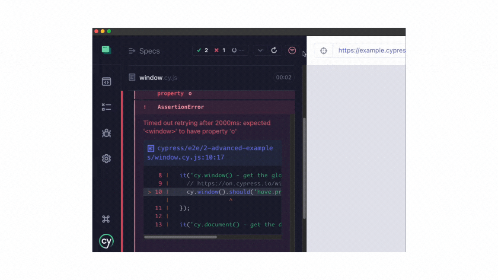

<h2 align=center>Cypress last-failed plugin</h2>
<p align="center">
</p>

<p align="center">
A companion Cypress plugin for <code>cy-grep</code> that re-runs the last failed test(s).
</p>




## Overview

Re-run the last failed tests in both `cypress run` and `cypress open` formats for improved development and debugging experience.

This plugin harnesses the powers of `cy-grep` from `@bahmutov/cy-grep` plugin and the Cypress Module API.

#### Table of Contents

- [Installation](#-installation)
- [Setup](#-setup)
- [Use](#-use)
  - [Filter failed tests within `cypress open`](#-filter-failed-tests-within-cypress-open)
  - [Usage with `cypress run`](#-usage-with-cypress-run)
    - [Setting up a `npm` script](#-setting-up-a-npm-script)
- [Contributions](#contributions)

---

## 📦 Installation

1. Install the following packages:

```sh
npm install --save-dev @bahmutov/cy-grep # Dependent package for the plugin
npm install --save-dev cypress-plugin-last-failed
```

2. In `cypress/support/e2e.js` (For E2E tests) and/or `cypress/support/component.js` (For Component tests),

```js
import { failedTestToggle } from 'cypress-plugin-last-failed';

const registerCypressGrep = require('@bahmutov/cy-grep');
registerCypressGrep();

failedTestToggle();
```

3. In `cypress.config`, include the following within `setupNodeEvents` for `e2e` and/or `component` testing:

```js
const { defineConfig } = require('cypress');
const { collectFailingTests } = require('cypress-plugin-last-failed');

module.exports = defineConfig({
  e2e: {
    setupNodeEvents(on, config) {
      collectFailingTests(on, config);

      require('@bahmutov/cy-grep/src/plugin')(config);
      return config;
    },
  },
});
```

---

## 🦺 Setup

### For `cypress run`

- To enable the plugin to collect and record the most recent run's failing tests, set the environment variable `collectFailingTests` to `true`.

Example:

```json
{
  "env": {
    "collectFailingTests": true
  }
}
```

- Once the plugin is enabled and to allow for the Cypress Module API node script to know which failed tests to run, failed test titles from each run will be written to a `test-results` directory.

  - By default, the `test-results` will be created in the root project directory.

  - To customize where the `test-results` directory should be stored, add the `failedTestDirectory` environment variable to `cypress.config` with the desired path from the config file:

```js
// Example using a fixtures folder path relative to the cypress.config

module.exports = defineConfig({
  env: {
    failedTestDirectory: './cypress/fixtures',
  },
  e2e: {
    setupNodeEvents(on, config) {},
  },
});
```

- **Optional**: If you do not want to commit the file storing last failed tests to your remote repository, include a rule within your project's `.gitignore` file:

```

# Last failed storage directory

**/test-results

```

### For `cypress open`

- **Optional**: Set two common environment variables tied to the `@bahmutov/cy-grep` package to enhance the experience utilizing the grep logic within the Cypress Test Runner UI using `cypress open`:

```json
{
  "env": {
    "grepOmitFiltered": true,
    "grepFilterSpecs": true
  }
}
```

> [!NOTE]
> More information on `grepOmitFiltered` and `grepFilterSpecs` can be read within the [README for `@bahmutov/cy-grep`](https://github.com/bahmutov/cy-grep?tab=readme-ov-file#pre-filter-specs-grepfilterspecs)

---

## 🧰 Use

This plugin has functionality for both `cypress open` and `cypress run`.

### ⌛ Filter failed tests within `cypress open`

Within the Cypress Test Runner UI using `cypress open`, this plugin provides a filter within each spec file.

Toggling the filter will run any previously failed tests on the particular spec file.


### 👟 Usage with `cypress run`

Run the following command to re-run the latest run's failed test(s) from the terminal:

```cli
npx cypress-run-last-failed run
```

You can also include more cli arguments as desired, as the `npx` command is pointing to a node script harnessing the power of [Cypress module API](https://docs.cypress.io/guides/guides/module-api):

```cli
npx cypress-run-last-failed run --e2e --browser chrome
```

#### 📃 Setting up a `npm` script

For convenience, you may desire to house the `npx` command within an npm script in your project's `package.json`, including any desired cli arguments:

```json
  "scripts": {
    "run-last-failed": "npx cypress-run-last-failed run --e2e --browser electron"
  }
```

## Contributions

Feel free to open a pull request or drop any feature request or bug in the [issues](https://github.com/dennisbergevin/cypress-plugin-last-failed/issues).

Please see more details in the [contributing doc](./CONTRIBUTING.md).
